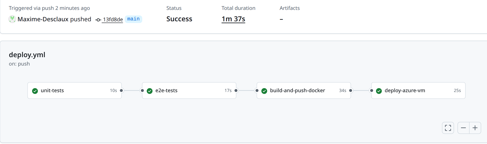

# TP Déploiement Continu Docker

## Description du projet
Ce projet consiste à déployer automatiquement une application web dans un conteneur Docker sur une VM Azure via GitHub Actions.

L'objectif est de mettre en place une **pipeline CI/CD complète** : tests unitaires, tests E2E, build et push Docker, puis déploiement automatique sur une VM Azure.

---

## Fonctionnement du pipeline CI/CD

La pipeline est déclenchée automatiquement **à chaque push sur la branche `main`**.

### Étapes du workflow

1. **Tests unitaires**  
   - Install dependencies : `npm install`  
   - Exécution : `npm test`  
   - La pipeline échoue si un test échoue.

2. **Tests E2E (end-to-end)**  
   - Démarrage du serveur en arrière-plan : `npm start &`  
   - Exécution des tests : `npm run e2e`  
   - Vérifie au moins le endpoint `/health` et une fonctionnalité supplémentaire.

3. **Build et push Docker**  
   - Construction de l'image : `docker build -t maximedesclaux/myapp:latest .`  
   - Push sur Docker Hub : `docker push maximedesclaux/myapp:latest`  
   - Étape exécutée uniquement si les tests unitaires et E2E réussissent.

4. **Déploiement sur VM Azure**  
   - Connexion à la VM via SSH.  
   - Pull de l'image Docker : `docker pull maximedesclaux/myapp:latest`  
   - Arrêt et suppression éventuelle du conteneur existant : `docker stop myapp || true && docker rm myapp || true`  
   - Lancement du conteneur : `docker run -d --name myapp -p 3000:3000 maximedesclaux/myapp:latest`  
   - Vérification avec : `curl http://localhost:3000/health`  
   - Déploiement idempotent : relancer la pipeline ne crée pas de doublons.


---

## Accès à l'application
- **IP publique de la VM Azure** : `20.199.65.166`  
- **Port exposé** : `3000`  
- Endpoint de vérification : [http://20.199.65.166:3000/health](http://20.199.65.166:3000/health)

---

## GitHub Secrets utilisés
- `DOCKER_USERNAME` : nom d’utilisateur Docker Hub  
- `DOCKER_TOKEN` : token Docker Hub  
- `AZURE_VM_IP` : IP publique de la VM Azure  
- `AZURE_VM_USER` : utilisateur SSH sur la VM  
- `AZURE_VM_SSH_KEY` : clé privée SSH pour la VM  

---

## Instructions pour exécuter localement
1. Cloner le dépôt :  
   ```bash
   git clone <URL_DU_DEPOT>
   cd TP_deploiement 

# Installer dépendances Node.js
npm install

# Lancer l'application localement
npm start

# Ou via Docker
```bash
docker build -t myapp:local .
docker run -d -p 3000:3000 myapp:local
curl http://localhost:3000/health